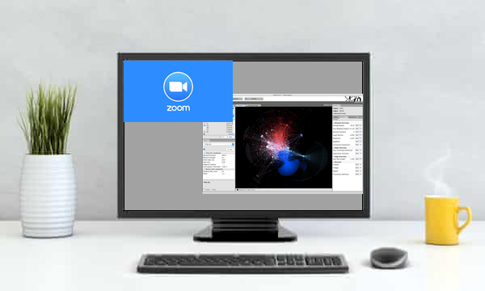

[WEBSITE]( https://cultureanalytics.github.io/DH2020/)

# Network Studies of Culture

Following the 2019 workshop, which focused on the use of time series as a way to understand and visualize humanities data, the 2020 workshop is dedicated to how network exploration and analysis can be similarly used to understand and visualize data. The questions at the focus the workshop are: How can network visualisations provide a distant viewing of data? What are the different steps to build a network? How to read it?

These are the questions, but in the wake of the COVID pandemic and the re-structuring of this year's DH2020 conference, we have some different answers than we intended. Instead of our planned series of events, we are planning to offer a series of videos that anyone with an internet connection (and bandwidth) can view. Then, on the day of the workshop, July 21,2020, we will host a live stream for registered participants to work with our presenter, Mathieu Jacomy, one of the developers of Gephi. Like last year's workshop, we will also have facilitators on hand to help with any technical, procedural, or theoretical issues that arise over the course of the workshop that participants prefer to be addressed individually.

The videos themselves are described in the schedule below and will be made available a week before the workshop on July 14, 2020, along with other materials, like sample datasets, which we hope will maximize our time together. 

We hope you will join us for this series of asynchronous and synchronous events! If you cannot, please feel free to view and/or download the materials and explore network studies of culture in a way most productive to you! If you have any questions, please feel free to contact one of us. 

**July 15 Update**: The workshop is full, and registration is closed. We are sorry for all those who have expressed interest, but for the workshop to succeed we can only handle so many people in the room -- even virtual rooms have their limits in terms of being able to give participants the attention they deserve!

## Schedule

The planned half-day workshop is now a collection of videos to watch ahead of a two-hour interactive session with our presenter, Mathieu Jacomy. The videos offer an exploration of culture analytics and networks for those interested in understanding the intersection of analytics and the humanities. Participants in the interactive session are expected to have Gephi already installed and the sample datasets already downloaded.

### What to do in Advance of the July 21 Workshop

Traditionally, we would all gather in a room and warm up for the workshop with some overviews and case studies to prime our imaginations for the possibilities. While we cannot be together this year, we still thought it would be useful to have some way to suggest some possibilities. 

We are especially excited by the opportunity to have Tim Tangherlini join us this year. Tangherlini has been instrumental not only in the development of culture analytics, through the long program he co-developed at UCLA's Institute for Pure and Applied Mathematics, but also in the introduction of network studies to humanities scholars: the NEH seminar on *Network Studies in the Humanities* was meeting ground, and launching pad, for a number of scholars active in the digital humanities today.

* Watch the **Keynote**: *Conspiracy in the Time of Covid: A Computational Pipeline for the Discovery of Conspiracy Narrative Frameworks*. Tim Tangherlini (University of California - Berkeley). [Watch the Keynote](keynote.md).
* Watch the **example** study: *Visualising the Merce Cunningham Company Network*. Clarisse Bardiot (UPHF).
<!-- * **Example**: *Understanding Small Corpora through Word Collocation Networks*. John Laudun (University of Louisiana). -->

To be able to use our time together efficiently, we would like to ask you to do the following things before the workshop:

* **Watch** these [three videos](https://www.youtube.com/playlist?list=PL7wfgmADqQfajFq4vcL6S4dTNI5WO-G3K).
* **Download** and **install** [Gephi](https://gephi.org/users/download/).
* Please **write down your questions in the Drive document** emailed to the participants. Here you can also signify your interest in the questions asked by other participants. This will ensure that we will be able to address the most pressing questions during the course of the workshop.

 

### The Workshop

The workshop itself will be held via Zoom and start at 5PM/17:00 CET (Central European Time -- e.g., *Paris*) or 11AM/11:00 ET (Eastern Time, e.g. *New York*). Registered participants will receive the Zoom link via email. We suggest everyone connect early, so that any connections issues that arise -- and they always do! -- can be addressed. 

During the workshop, we want to encourage everyone to work alongside Mathieu as he walks us through ingesting data into Gephi, setting up a network visualization, and then understanding what they are seeing. In a live setting, that usually means the presenter projects his/her work onto a screen and participants switch between the screen and their own laptop screens. We won't have that here, and so we encourage you, if you can, to set yourself up with two screens or to find the largest possible screen to which you have access so that you can have the Zoom video playing in one window and then Gephi in another window adjacent to it:

| Time    | Event |
| ------- |-------|
|05:00pm |  Start of the session, welcome, practical issues.
|05:15pm | 	Hands-on: Mathieu Jacomy, developer of Gephi : Gephi is a popular network visualization and analysis tool. It helps scholar investigate empirical phenomena that can be seen as nodes and links, entities and relations. Drawing from graph theory and information design, it helps shifting the focus from the entities to their relations. It repurposes computational metrics to describe and characterize the topology of empirical networks. In this tutorial you will learn the basics of Gephi, how to read its visualizations, which metrics to use in different situations, and how to organize an exploratory data analysis in a humanities setting.|
|06:30pm | Break                                  |
|06:45pm | Continuation of the hands-on session.  |
|07:45pm | Wrap up                                |
|08:00pm | End of the workshop                    |

## Workshop material

### Gephi videos

Mathieu produced three videos ahead of the workshop, to help you familiraize with Gephi beforehand. The first one, in particular, helps you install Gephi and tackle possible Java issues.

* [How to install Gephi 0.9.2](https://youtu.be/DMOWhqp6lHQ) (also [on GitHub](https://cultureanalytics.github.io/DH2020/video/How%20to%20install%20Gephi/2020-06%20How%20to%20install%20Gephi.html))
* [First contact with Gephi 0.9.2](https://youtu.be/YM_37z_uURM)
* [Layouts, clusters, and where to find them](https://youtu.be/0LqY8OfSsKE)

### Network data sets

The data sets are hosted on the GitHub repository. Instructions in the READ ME:
https://github.com/CultureAnalytics/DH2020/tree/master/data

## Workshop Leaders

### Presenter

**Mathieu Jacomy** is a co-founder of Gephi. He is a PhD student in techno-anthropology at the Aalborg University TANT Lab, and has been a research engineer for 10 years at the Sciences Po médialab in Paris. He develops digital instruments involving data visualization and network analysis for the social science and humanities. His current research focuses on visual network analysis, digital methods and issue mapping. He contributes to developing the web crawler Hyphe, the online network sharing platform MiniVan, and Gephi. He tweets at @jacomyma and blogs at [reticular.hypotheses.org](http://reticular.hypotheses.org/).

### Facilitators

**Clarisse Bardiot** is an associate professor at the Université Polytechnique Hauts-de-France (France) and a research fellow at the CNRS. Bardiot is a researcher, a publisher and a curator, who has been working in the fields of digital performances history, digital humanities, documentation and preservation of time based media art works, and digital publishing. Since 2012, she has received various grants to develop Rekall and MemoRekall, an open source environment and a webapp to analyse, document and preserve time based media art.
Email: 	clarisse_bardiot@mac.com
Website with CV: www.clarissebardiot.info
Key project: www.memorekall.com

**Mila Oiva** is a postdoctoral researcher at the University of Turku (Finland) where she is a cultural historian and expert on Russian and Polish 20th century history and digital humanities. She works as a postdoctoral scholar at the Ancient Finnish Kings a computational study of pseudohistory, medievalism and history politics in contemporary Finland and Russia. She is currently co-editing a special issue "Lab & Slack: Situated Research Practices in Digital Humanities" of the _Digital Humanities Quarterly_ and an edited volume _History in the Digital Era_ for the Helsinki University Press. Her research interests consist of transfer of knowledge and information flows and temporal change.
Email: 	milaoiv@utu.fi
Website with CV: https://historydrafts.blogspot.com/p/blog-page.html
Key project: https://sites.utu.fi/pseudohistoria/en/

**John Laudun** is professor of English at the University of Louisiana (USA). His research focuses on folk narrative, both as a textual production in and of itself as well as a networked phenomenon. His published work includes a book-length study of embedded creativity and articles on folklore in both traditional and digital environments. In addition to scholarly journals and anthologies, his work is also featured in archives, CDs, films, and television series, and he has received funding from the NSF, NEH, the Andrew Mellon Foundation, the MacArthur Foundation, and the Jacob K. Javits program of the U.S. Department of Education. laudun@louisiana.edu. http://johnlaudun.org/.

## About Culture Analytics

Culture Analytics is a collaborative, translational data science that explores culture and cultural interaction as a multi-scale / multi-resolution phenomenon. The macroscopic view, that allows a researcher to move from the microscale of close reading, up through the mesoscales, and on to the macroscale of distant reading, is a hallmark of the field. Culture analytics is focused on the productive intersection between humanities, mathematics, and data science.